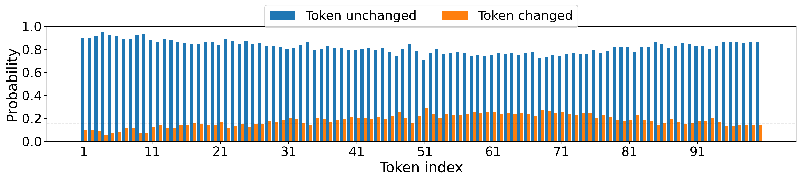
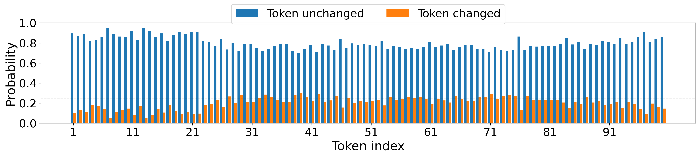
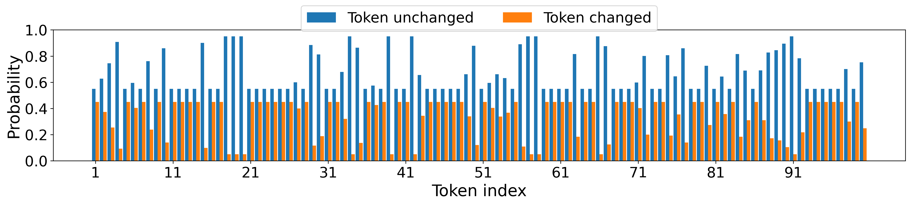

# Additional Rebuttal Results

This repository contains all additional results requested by Reviewers during the Rebuttal phase.

## Paraphrasing Attack Probability Distributions

### Synonym Substitution Attack

### DIPPER Paraphrasing Attack

### Back-Translation Attack

## Paraphrasing Datasets

The paraphrasing datasets used in our experiments are available as JSON files:

- `synonym_substitution_paraphrase_dataset.json`
- `dipper_paraphrase_dataset.json`
- `backtranslation_paraphrase_dataset.json`

## Robustness-Detectability Trade-off

Detailed results on the robustness-detectability trade-off across different watermarking schemes are available in the [Performance Evaluation](Performance-evaluation.md) page.
